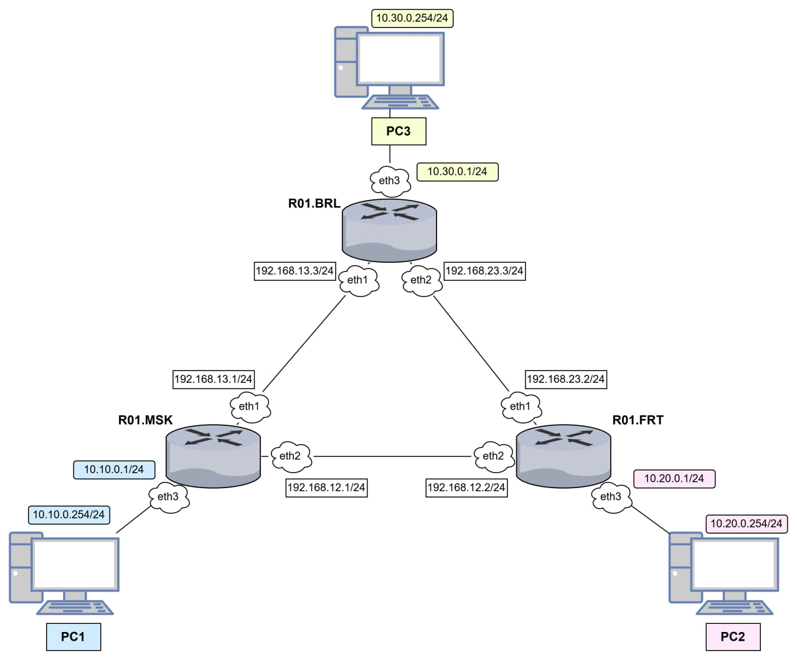

University: [ITMO University](https://itmo.ru/ru/)

Faculty: [FICT](https://fict.itmo.ru)

Course: [Introduction in routing](https://github.com/itmo-ict-faculty/introduction-in-routing)

Year: 2025/2026

Group: K3323

Author: Orlova Alena Aleksandrovna

Lab: Lab1

Date of create: 24.10.2025

Date of finished: 17.11.2025

# Лабораторная работа №2 "Эмуляция распределенной корпоративной сети связи, настройка статической маршрутизации между филиалами"

# Описание
В данной лабораторной работе вы первый раз познакомитесь с компанией "RogaIKopita Games" LLC которая занимается разработкой мобильных игр с офисами в Москве, Франкфурте и Берлине. Для обеспечения работы своих офисов "RogaIKopita Games" вам как сетевому инженеру необходимо установить 3 роутера, назначить на них IP адресацию и поднять статическую маршрутизацию. В результате работы сотрудник из Москвы должен иметь возможность обмениваться данными с сотрудником из Франкфурта или Берлина и наоборот.

# Цель работы
Ознакомиться с принципами планирования IP адресов, настройке статической маршрутизации и сетевыми функциями устройств.

# Ход работы

## Схема сети
Описываю схему сети в файле lab2.yaml в соответствии с заданием. 

```
name: lab2
mgmt:
  network: new_mgmt
  ipv4-subnet: 172.20.20.0/24

topology:
  kinds:
    vr-ros:
      image: vrnetlab/mikrotik_routeros:6.47.9

  nodes:
    R01.BRL:
      kind: vr-ros
      mgmt-ipv4: 172.20.20.103
      startup-config: configs/r01_BRL.rsc
    R01.FRT:
      kind: vr-ros
      mgmt-ipv4: 172.20.20.102
      startup-config: configs/r01_FRT.rsc
    R01.MSK:
      kind: vr-ros
      mgmt-ipv4: 172.20.20.101
      startup-config: configs/r01_MSK.rsc
    PC1:
      kind: linux
      image: alpine:latest
      mgmt-ipv4: 172.20.20.2
      binds:
        - ./configs:/configs
      exec:
        - sh /configs/pc1.sh
    PC2:
      kind: linux
      image: alpine:latest
      mgmt-ipv4: 172.20.20.3
      binds:
        - ./configs:/configs
      exec:
        - sh /configs/pc2.sh
    PC3:
      kind: linux
      image: alpine:latest
      mgmt-ipv4: 172.20.20.4
      binds:
        - ./configs:/configs
      exec:
        - sh /configs/pc3.sh

  links:
    - endpoints: ["R01.BRL:eth1","R01.MSK:eth2"]
    - endpoints: ["R01.BRL:eth2","R01.FRT:eth1"]
    - endpoints: ["R01.MSK:eth1","R01.FRT:eth2"]
    - endpoints: ["R01.BRL:eth3","PC3:eth1"]
    - endpoints: ["R01.FRT:eth3","PC2:eth1"]
    - endpoints: ["R01.MSK:eth3","PC1:eth1"]
```
В топологии создаю сеть из 6 узлов - 3 роутера + 3 пк, каждый роутер подсоединён к своему компьютеру через eth3 и между собой через eth1 & eth2., управление задаю через подсеть 172.20.20.0/24, конфигурации загружаются автоматически из папки configs.

Также создаю схему сети в draw.io:



С помощью команды sudo containerlab graph -t ~/containerlab/lab2/lab2.yaml -o lab2-topology.svg в браузере можно открыть готовую схему сети:


## Configs

### Конфигурация роутеров

Сначала задаю айпишники на интерфейсах маршрутизатора: через ether2 - линия москва/берлин, через ether3 - линия москва/франкфурт, а интерфейс ether4 это локальная сеть московского офиса:
```
/ip address
add address=192.168.13.1/24 interface=ether2
add address=192.168.12.1/24 interface=ether3
add address=10.10.0.1/24 interface=ether4
```
Дальше создается пул адресов дл dhcp сервера:
```
/ip pool
add name=dhcp_msk_pool ranges=10.10.0.10-10.10.0.254
```
Настраиваю параметры сети dhcp - указываю, для какой подсети сервис лействует и какой шлюз должен использоваться клиентами:
```
/ip dhcp-server network
add address=10.10.0.0/24 gateway=10.10.0.1
```
Дальше создается сам dhcp-сервер, привязывается к интерфейсу ether4:
```
/ip dhcp-server
add address-pool=dhcp_msk_pool disabled=no interface=ether4 name=dhcp_msk
```
Здесь настраивается как раз статическая маршрутизация по заданию, чтобы московский офис мог находить сети других филиалов:
```
/ip route
add dst-address 10.20.0.0/24 gateway=192.168.12.2
add dst-address 10.30.0.0/24 gateway=192.168.13.3
```
Меняю имя системы:
```
/system identity
set name=R_MSK
```
Добавляю нового пользователя с полными правами и удаляю админа:
```
/user
add name=alena password=alena group=full
remove admin
```

По аналогии делаются конфиги для Берлина и Франкфурта: адрес на интерфейсах в сторону комьютера будет иметь вид 10.х.0.1/24 , вместо х будет 20 для Франкфурта и 30 для Берлина, а остальные адреса в межроутерных сетях будут иметь вид 192.168.a.b/24, а - номер подсети, соединяющей два роутера, b - номер города для Франкфурта - 2, для Берлина - 3.

### Конфигурация ПК

У всех конечных устройств также похожий скрипт, через который сначала включается нужный сетевой интерфейс, потом запускается dhcp-клиент на этом интерфейсе. Также необходимо удалить стандартный маршрут по умолчанию, потому что он является приоритетным, и если его не убрать, сама сеть будет перехватывать все запросы, и компьютеры не смогут общаться. И остается добавить новый маршрут по умолчанию на замену старом, весь трафик будет идти через роутер офиса:
```
#!/bin/sh

ip link set eth1 up
udhcpc -i eth1 -q

ip route del default via 172.50.0.1 dev eth0
ip route add default via 10.10.0.1 dev eth1
```

# Результаты

Успешный деплой проекта:


Успешная раздача айпишников через dhcp-сервер, сохраненные прописанные маршруты на роутере, доступность роутеров друг между другом:


Успешное получение ПК апйишников от dhcp-сервера и пинг между ними:


